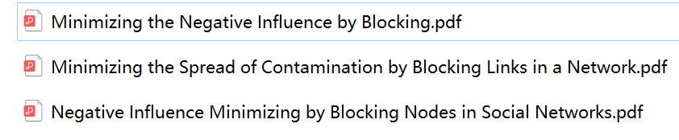

- 论文
    - 最小化通过堵塞节点或者边的三篇，用的都是IC模型和贪心算法
      
- 代码：贪心算法找最优堵塞边
    - https://github.com/liulin0x3c/-
    - 蒙特卡洛模拟算堵塞不同边的IC模型传播的期望
    - 初始点集：5
    - 阻塞边数目：5
    - 数据集：脸书数据数据集的部分
        - 随机取1/10边
        - 强制指定边的方向
        - 边：8859，点：3293